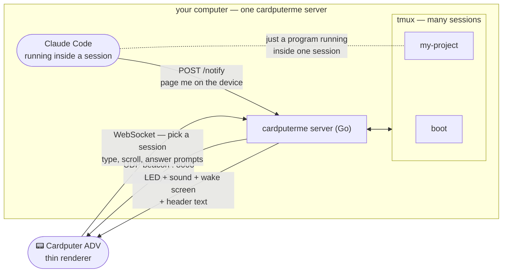
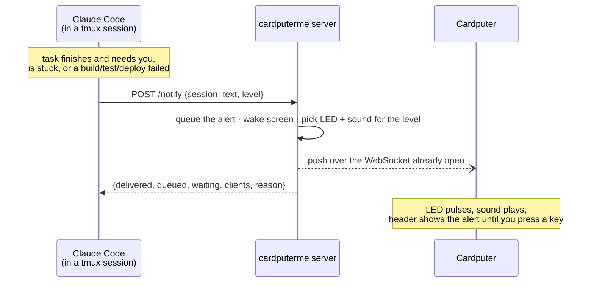

# cardputerme

Turn any cardputer adv into claude code pager to warn you and make decision anywhere at you home.

**Expose any terminal to an [M5Stack Cardputer ADV](https://shop.m5stack.com/products/m5stack-cardputer-kit-w-m5stamps3) and drive it from your pocket.** Install once, and every tmux session on your computer exposes itself automatically

```
curl -fsSL https://raw.githubusercontent.com/brutalzinn/cardputerme/main/install.sh | sh
```

Open a terminal (or don't — a default session named `boot` is always there). Pick it on the Cardputer and start typing. That's the whole workflow.

**See it in action:** [youtu.be/dTU2-G5nL3Q](https://youtu.be/dTU2-G5nL3Q)

---

## How it works

`cardputerme` runs a **single background server per machine**, started once (a login-time watchdog keeps it and a default `boot` tmux session alive even if you never open a terminal), and broadcasts a tiny **UDP beacon** every 2 seconds.

You can expose any tmux session to cardputer easily and can see it at realtime at your cardputer screen



The device is a thin renderer: the server owns the input buffer, history, viewport, colors and layout, and mirrors the terminal's own screen. Any behavior change is a server change. Why? because upload new firmware everytime is sucks

---

## Install

**Requirement:** `tmux` (`brew install tmux` / `apt install tmux`) — the invisible capture backend; you never interact with it directly. It is not optional: the installer, the launcher and the server each refuse to run without it.

```
curl -fsSL https://raw.githubusercontent.com/brutalzinn/cardputerme/main/install.sh | sh
```

Grabs the matching binary from the latest [GitHub Release](https://github.com/brutalzinn/cardputerme/releases), verifies its checksum and installs `cardputerme` into `/usr/local/bin` (or `~/.local/bin` when that is not writable).

Then, so nothing needs to be run by hand afterward, the installer also:

- Adds a tmux hook (`~/.tmux.conf`, applied live if tmux is already running) that exposes **every new tmux session** the instant it's created.
- Registers a login-time watchdog — a macOS `launchctl` LaunchAgent or a Linux `systemd --user` timer — that keeps a default tmux session named **`boot`** alive (recreating it if it was ever killed) and makes sure the cardputerme server is running, checked every 60 seconds. This is what makes the device usable **before you've opened any terminal at all**.

Every tmux session on the machine becomes visible on the LAN by default now (there's no login on the device — anyone who can see the beacon and pick a session can drive it). Same threat model as before, just wider surface since it's opt-out instead of opt-in; keep that in mind on a shared or untrusted network.

**From source** (needs Go ≥ 1.26 — the launcher builds the server on first run):

```
git clone <repo> && cd cardputerme
make setup     # fetch Go deps + create firmware/.env from the template
echo "alias cardputerme=\"$PWD/bin/cardputer-server\"" >> ~/.zshrc && source ~/.zshrc
```

**Flash the Cardputer once.** Set your Wi-Fi in the `.env` that `make setup` created, then upload:

```
# edit firmware/cardputer/.env → set WIFI_SSID and WIFI_PASS
make flash     # build + upload the firmware to the Cardputer
```

The Cardputer and your computer must be on the **same Wi-Fi network** (the beacon is a LAN broadcast).

---

## Using it

### Expose a terminal (on your computer)

Nothing to do — open a tmux session (`tmux new -s myproject`, or just start typing in the default `boot` session) and it appears on the device within a couple of seconds. The tmux hook installed by `install.sh` handles it.

Re-running the same name just says "already exposed". Each exposure prints a log path under `~/.cardputerme/<name>.log`. The server stays up even with zero terminals exposed (it's what watches for the next one) — it only exits after a configurable idle stretch with no device connected.

### Connect (on the Cardputer)

1. It joins Wi-Fi, then shows the **server list** — each row is `name` + `IP:port`. If there's only one, it auto-connects.
2. Press the **number** next to an exposure to connect.
3. You now see that terminal mirrored live. Type — it's a real shell.

### Keys

| Key                      | Action                                                             |
| ------------------------ | ------------------------------------------------------------------ |
| letters / numbers        | type into the command buffer                                       |
| **Enter**                | send the line (or confirm) · **Shift+Enter** newline               |
| **digits** (at a prompt) | answer an on-screen `1./2./3.` menu                                |
| **esc**                  | clear the buffer, or send a real Escape if empty                   |
| **Shift+esc**            | interrupt (stops an agent / sends Escape to the app)               |
| **fn + arrows**          | scroll/read around the screen (pan)                                |
| **opt + arrows**         | send real arrow keys (drive a TUI's own selector)                  |
| **ctrl + letter**        | control key (Ctrl+C, etc.)                                         |
| **ctrl + up/down**       | recall previous / next command                                     |
| **Tab**                  | accept the dim autosuggested command (else passes to the terminal) |
| **ctrl + = / ctrl + \_** | zoom text in / out · **ctrl + space** reset zoom                   |
| **fn + esc**             | back to the server list                                            |

---

## Running Claude Code (or any long-lived program)

Every exposure is a **persistent tmux session**, so anything you start in it keeps running when you close your laptop lid or walk away — and you can watch and steer it from the Cardputer. This is the point of the project: kick off [Claude Code](https://claude.com/claude-code) (or an agent, a long build, a REPL) at your desk, then monitor and nudge it from your pocket.

**Start it from the Cardputer** — the simplest way:

```
cd ~/my-project
tmux new -s my-project      # or just start typing in `boot`
```

It appears on the device automatically. Connect, type `claude`, press Enter. Claude Code now runs in the exposed session and you drive it entirely from the Cardputer — answer its permission prompts with the **number keys**, interrupt with **Shift+esc**, scroll its output with **fn+arrows**.

**Start it at your desk, then follow it from your pocket** — the power move. Every exposure already _is_ a real tmux session, so just attach to it on your computer:

```
cd ~/my-project
tmux new -s my-project      # exposes itself — nothing else to run
claude                      # run Claude Code here
# ...work at your desk, then Ctrl-b d to detach — it keeps running
```

Now your desk screen **and** the Cardputer mirror the same live session — type from either. Detach at your desk (`Ctrl-b d`), pick up your Cardputer, and keep answering Claude's questions and watching its progress while you're away from the keyboard. (`Ctrl-b` is tmux's prefix; `d` detaches.)

### The `/cardputer` skill (page yourself from inside Claude Code)

This repo ships a **Claude Code plugin** with a `/cardputer` skill. It has nothing to do with exposing sessions — that's automatic now — it teaches Claude Code to page you on the device with `POST /notify` when it actually needs your attention: finished a long task, is stuck, or a build/test/deploy just failed.



`delivered:false` is not an error — the alert is queued either way and reaches the device the moment one is looking; `reason` says why it didn't go out immediately (no device connected, or you silenced alerts with `;notify 0`). This is the _only_ thing Claude Code does deliberately — it never links, unlinks or inspects sessions, and exposing the session it's running in is automatic, same as any other shell.

Install as a plugin:

```
/plugin marketplace add brutalzinn/cardputerme
/plugin install cardputerme@cardputerme
```

Or symlink the skill straight from your clone into your Claude config (works across accounts):

```
ln -sfn "$PWD/skills/cardputer" ~/.claude/skills/cardputer
```

Then Claude Code pages you on its own judgment — no `/cardputer` invocation needed on your part.

---

## Layout

```
├── bin/cardputer-server   # the CLI (aliased as `cardputerme`)
├── server-go/             # Go server — one process per exposed terminal, event-driven
│   ├── cmd/cardputerme/   #   entry point
│   └── internal/          #   screen · input · discovery · terminal · server
└── firmware/cardputer/    # flashed once to the Cardputer ADV
```

## Develop

A `Makefile` at the repo root covers setup — run `make` to list targets:

```
make setup      # install Go deps + create firmware/.env
make test       # run the server tests
make flash      # upload firmware to the Cardputer
make release    # cross-compile CLI binaries into dist/ (macOS + Linux)
```

The tmux backend lives only in `internal/terminal/` — a PTY backend can drop in behind the same interface. The device does no content logic, so most changes are server-side and need no re-flash.
